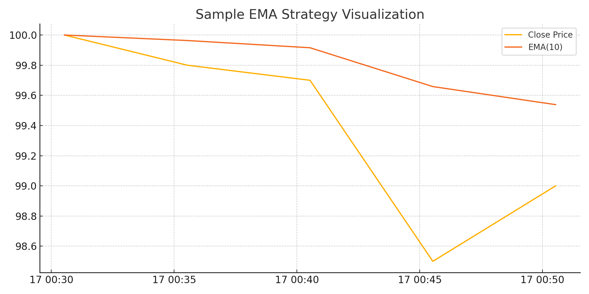

# 📊 Quant Strategy Optimizer (EMA-Based)

This project automatically optimizes the strategy parameters using a basic EMA-based signal generator and evaluates its performance.

## 💡 Strategy
If close > EMA: BUY  
If close < EMA: SELL

## ⚙️ Optimization
Backtests different EMA periods to find the best one in terms of profitability.

## 📁 Files
- `optimizer.py`: Core script to test EMA ranges
- `strategy.py`: Applies EMA-based signal logic
- `metrics.py`: Calculates performance

## 📈 Preview


## 🚀 How to run
```bash
python optimizer.py
```
